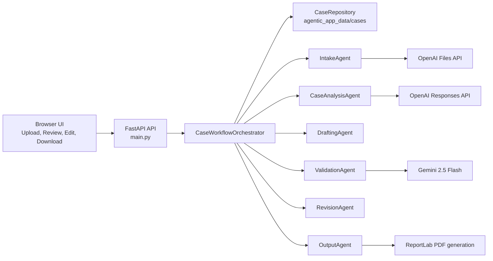
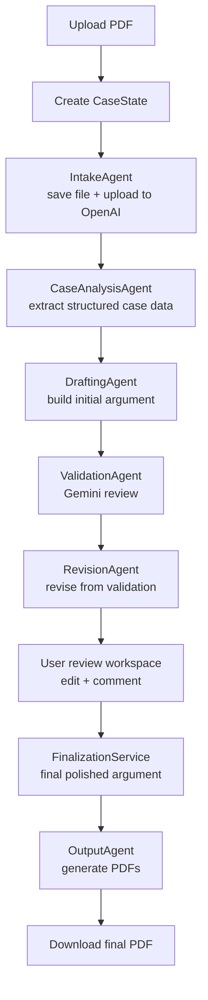
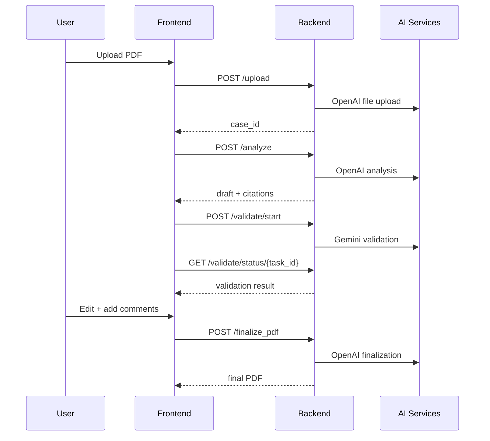

# AI Legal Drafter - Technical Documentation

## Overview

AI Legal Drafter is a FastAPI application for analysing Indian case documents, generating legal arguments, validating them with Gemini, revising them through an agentic workflow, and exporting final PDFs.

The current system is built around a persisted `CaseState` and an orchestrated set of agents rather than one monolithic request pipeline.

## Goals

- Accept uploaded legal PDFs and convert them into a structured case record
- Extract critical facts such as applicant, defendant, charges, and demands
- Generate stronger, citation-backed legal arguments
- Prefer Supreme Court authorities and validate citation links more carefully
- Review the draft with Gemini
- Let the user edit, comment, finalise, and download a polished PDF

## Architecture

### High-Level System



### Agentic Workflow



### State Model

Each case is stored as a JSON-backed `CaseState`.

Key fields:

- `case_id`
- `uploaded_pdf_path`
- `original_filename`
- `openai_file_id`
- `analysis`
- `draft_text`
- `validation_text`
- `validation_data`
- `amended_draft_text`
- `final_draft_text`
- `reviewer_comments`
- `artifacts`
- `status`
- `errors`

## Repository Structure

```text
ai_legal_drafter/
├── agentic_app/
│   ├── agents/
│   │   ├── base.py
│   │   ├── case_analysis_agent.py
│   │   ├── drafting_agent.py
│   │   ├── intake_agent.py
│   │   ├── output_agent.py
│   │   ├── revision_agent.py
│   │   └── validation_agent.py
│   ├── models.py
│   ├── orchestrator.py
│   ├── repository.py
│   └── services.py
├── static/
│   └── script.js
├── templates/
│   └── index.html
├── main.py
├── openai_client.py
├── gemini_validator.py
├── prompt.py
├── pdf_generator.py
└── DOCUMENTATION.md
```

## Request Flow

### 1. Upload

- Frontend sends `POST /upload`
- Backend creates a new `CaseState`
- Intake agent saves the uploaded file
- Intake agent uploads the file to OpenAI Files API
- `case_id` is returned to the frontend

### 2. Analyse

- Frontend sends `POST /analyze` with `case_id`
- Analysis agent extracts:
  - applicant
  - defendant/respondent
  - charges
  - demands
  - arguments
  - citations
- Citation refinement runs after extraction
- Drafting agent builds the initial legal argument text

### 3. Validate

- Frontend sends `POST /validate/start`
- Background validation task calls Gemini 2.5 Flash
- Gemini scores logic, citations, and weaknesses
- Validation results are persisted to the case state

### 4. Revise

- Revision agent rewrites the draft based on the validation report
- It can consider humanitarian grounds, mental health, and the spirit of the law when supportable

### 5. Review and Finalise

- User edits the draft in the browser
- User selects text and adds reviewer comments
- Frontend sends `POST /finalize_pdf`
- Finalization service incorporates:
  - edited draft text
  - validation output
  - reviewer comments

### 6. Export

- Output agent creates:
  - baseline output PDF
  - validated PDF
  - amended PDF
  - final PDF
  - downloadable file in `~/Downloads`

## API Reference

### `GET /`

Serves the web UI.

### `POST /upload`

Uploads the PDF and creates a new case.

Response:

```json
{
  "status": "uploaded",
  "case_id": "uuid"
}
```

### `POST /analyze`

Request:

```json
{
  "case_id": "uuid"
}
```

Response:

```json
{
  "text": "LEGAL ARGUMENT ...",
  "citations": [],
  "case_id": "uuid"
}
```

### `POST /validate/start`

Starts asynchronous validation.

### `GET /validate/status/{task_id}`

Returns validation task state.

### `POST /generate_pdf`

Generates an output PDF for a case.

### `POST /finalize_pdf`

Request:

```json
{
  "case_id": "uuid",
  "edited_text": "edited draft",
  "comments": [
    {
      "selected_text": "text",
      "comment": "instruction"
    }
  ]
}
```

Returns the final PDF as a file response.

### `GET /cases/{case_id}`

Returns the persisted case state for the UI.

## Citation Resolution Logic

The citation pipeline is intentionally stricter than the original implementation.

### Generation

The first OpenAI pass generates candidate citations with:

- case name
- court
- description
- why cited
- relevance/strength scores
- tentative link metadata

### Refinement

A second OpenAI pass filters and reorders citations to:

- prefer Supreme Court authorities
- reduce weak or irrelevant citations
- preserve only better-supported authorities

### Link Resolution

The app then constructs an Indian Kanoon search URL using:

`ruling + <case name>`

It fetches the result page and:

- extracts `/doc/<id>/` candidates
- compares result titles against the target case name
- selects the best-matching result title
- falls back to a search URL if no sufficiently relevant direct result exists

### Limitation

Current validation is title-based on the search result page. It is stronger than “first `/doc/` hit wins”, but it is not yet a full document-page semantic verifier.

## Frontend Review Workspace

### Review Screen Features

- editable rich-text argument area
- inline citation references
- right-hand citation details panel
- selection-based reviewer comments
- validation summary
- finalisation progress bar and logs

### Frontend Flow



## Configuration

Environment variables expected in `.env`:

- `OPENAI_API_KEY`
- `GEMINI_API_KEY`

## Dependencies

Core dependencies from `requirements.txt`:

- `fastapi`
- `uvicorn`
- `openai`
- `python-multipart`
- `jinja2`
- `reportlab`
- `python-dotenv`
- `google-generativeai`

## Operational Notes

- The app persists runtime case data in `agentic_app_data/`
- Generated downloadable PDFs are written to the user’s `~/Downloads`
- The current Gemini SDK is deprecated upstream; migration to `google.genai` is advisable
- The current codebase still runs on Python 3.9, though newer Python versions are preferable

## Known Improvement Areas

- deterministic document-page citation verification
- stronger extraction of party names and charges from varied pleadings
- database-backed persistence instead of local JSON files
- test coverage for orchestrator paths and citation resolution
- migration away from deprecated Gemini SDK
