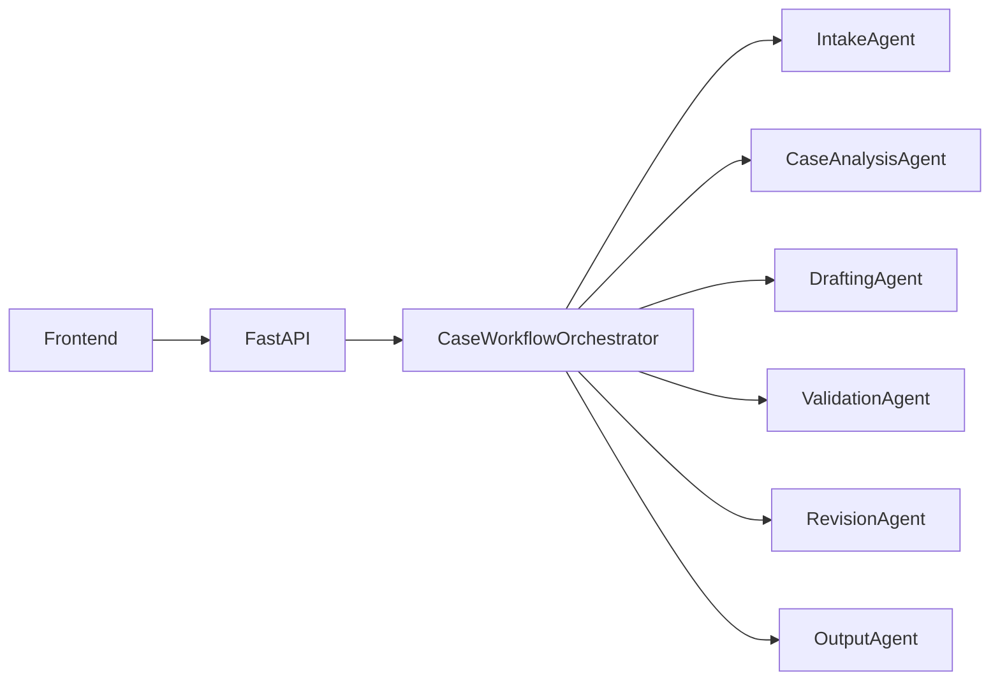

# AI Legal Drafter

AI Legal Drafter is a FastAPI-based legal drafting system for analysing Indian case PDFs, generating structured legal arguments, validating them with Gemini, revising them through an agentic workflow, and exporting final downloadable PDFs.

## Features

- Upload case PDFs and persist them as case records
- Extract applicant, defendant, charges, and demands
- Generate legal arguments with citation support
- Prefer Supreme Court authorities over weaker High Court alternatives
- Resolve Indian Kanoon citation links more carefully
- Validate reasoning with Gemini 2.5 Flash
- Revise drafts before user review
- Let users edit, comment, finalise, and download the final argument PDF

## Tech Stack

- FastAPI
- OpenAI Responses API
- Gemini 2.5 Flash
- ReportLab
- Vanilla HTML/CSS/JavaScript

## Architecture

The app uses an agentic workflow centered around a persisted `CaseState`.



See [DOCUMENTATION.md](./DOCUMENTATION.md) for the full architecture and API reference.

## Project Structure

```text
.
├── agentic_app/
├── static/
├── templates/
├── main.py
├── openai_client.py
├── gemini_validator.py
├── prompt.py
├── pdf_generator.py
├── DOCUMENTATION.md
└── README.md
```

## Setup

### 1. Install dependencies

```bash
python3 -m venv .venv
source .venv/bin/activate
pip install -r requirements.txt
```

### 2. Configure environment

Create a `.env` file with:

```env
OPENAI_API_KEY=your_openai_key
GEMINI_API_KEY=your_gemini_key
```

### 3. Run the server

```bash
uvicorn main:app --host 127.0.0.1 --port 8000
```

Open:

[http://127.0.0.1:8000](http://127.0.0.1:8000)

## Main Workflow

1. Upload a case PDF.
2. Analyse the case and generate the first draft.
3. Validate the draft with Gemini.
4. Revise and review the draft in the browser.
5. Add comments and finalise the argument.
6. Download the generated PDF.

## API Endpoints

- `GET /`
- `POST /upload`
- `POST /analyze`
- `POST /validate/start`
- `GET /validate/status/{task_id}`
- `POST /generate_pdf`
- `POST /finalize_pdf`
- `GET /cases/{case_id}`

## Citation Handling

The app now:

- prefers Supreme Court citations
- refines candidate citations in a second pass
- searches Indian Kanoon using `ruling + <case name>`
- attempts to resolve a matching `/doc/<id>/` result based on the visible result title
- falls back to a search link if a stronger match is not available

## Notes

- Runtime case data is stored in `agentic_app_data/`
- Downloaded PDFs are written to the local `~/Downloads` folder
- The Gemini SDK currently used in the project is deprecated upstream and should eventually be migrated

## License

Add a project license if you plan to distribute or open-source the repository broadly.
